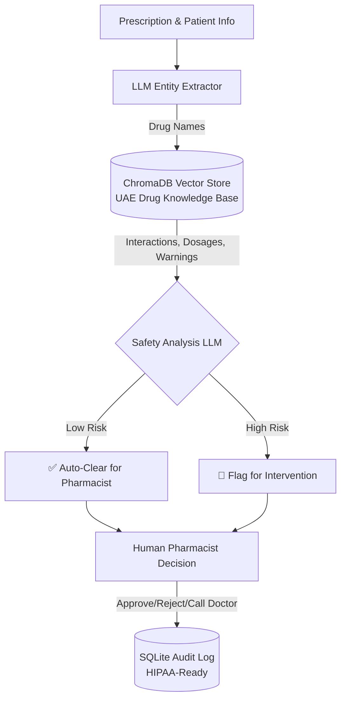

# Prescription Verification System (RAG + Human-in-Loop)

## 🎯 Problem Statement
UAE pharmacies process thousands of prescriptions daily. Checking for drug interactions, patient contraindications (pregnancy, allergies, age), and correct dosages is time-consuming and prone to human error. This system uses **Retrieval-Augmented Generation (RAG)** combined with a **Human-in-the-Loop** workflow to catch life-threatening errors before dispensing.

## 🏗️ Architecture



## 🚀 Key Features
- **RAG Drug Database**: Built-in knowledge base using `ChromaDB` for rapid retrieval of interactions and UAE MOH guidelines.
- **Human-in-the-Loop**: High-risk prescriptions CANNOT be auto-dispensed; human override and notes are mandatory.
- **Audit Logging**: Every action is saved to an SQLite database with timestamps, pharmacist ID, and AI risk level.
- **Safety First**: System defaults to cautious recommendations for pregnant patients, pediatric cases, and severe drug interactions (e.g., Warfarin + NSAIDs).

## 🛠️ Tech Stack
- **Database**: ChromaDB (Vector DB) + SQLite (Audit Log)
- **Embeddings**: Google Generative AI Embeddings
- **LLM**: Gemini 2.5 Flash Lite
- **UI**: Streamlit

## ⚙️ Setup & Run

```bash
git clone https://github.com/G-Narendra/Prescription-Verification-System.git
cd Prescription-Verification-System
pip install -r requirements.txt
cp .env.example .env  # Add your Gemini API key

# 1. Build the ChromaDB vector store
python scripts/build_drug_database.py

# 2. Run the Streamlit Application
streamlit run app.py
```

## 📋 Evaluation (Test Cases Provided)
- **Safe Routine Rx**: Amlodipine 5mg for a 45M. AI flags as LOW RISK.
- **Severe Interaction**: Ciprofloxacin for a patient on Warfarin. AI flags as HIGH RISK (major bleeding risk).
- **Contraindication**: Lisinopril for a pregnant patient. AI flags as HIGH RISK (Category D).

## ⚠️ Medical Disclaimer
**FOR EDUCATIONAL PURPOSES ONLY.** This system is a proof-of-concept AI assistant. It does not replace the professional judgment of a licensed pharmacist or physician. Not for actual clinical use.
