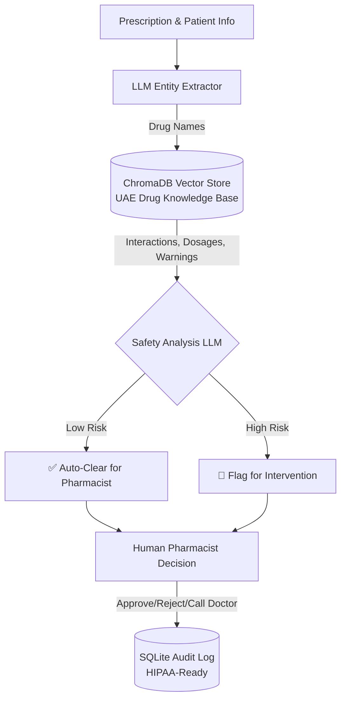

# Prescription Verification System (RAG + Human-in-Loop)

## 🎯 Problem Statement
UAE pharmacies process thousands of prescriptions daily. Checking for drug interactions, patient contraindications (pregnancy, allergies, age), and correct dosages is time-consuming and prone to human error — a pharmacist checking a prescription has 15-30 seconds before the next customer, yet must cross-reference multiple drug databases. Existing clinical decision support systems (Epocrates, Medscape) focus on drug information lookup, not end-to-end prescription verification with structured risk assessment.

I built a RAG pipeline that retrieves drug safety information from a local ChromaDB knowledge base, then uses an LLM to analyze the prescription against patient context. The system was designed with a fail-safe: if the LLM output cannot be parsed as valid JSON, the system defaults to HIGH risk and recommends manual review — an unparsed safety check means the verification didn't complete, and the only safe assumption is to escalate. Drug names extracted by the LLM are cross-checked against a local drug index; unknown names are explicitly flagged as UNVERIFIED in the prompt context, preventing the model from treating hallucinated drug names as trusted knowledge. The audit log tracks every verification with pharmacist ID, creating a traceable trail for regulatory compliance.

## 🏗️ Architecture



## 🚀 Key Features
- **RAG Drug Database**: Built-in knowledge base using `ChromaDB` for rapid retrieval of interactions and UAE MOH guidelines.
- **Human-in-the-Loop**: High-risk prescriptions CANNOT be auto-dispensed; human override and notes are mandatory.
- **Audit Logging**: Every action is saved to an SQLite database with timestamps, pharmacist ID, and AI risk level.
- **Safety First**: System defaults to cautious recommendations for pregnant patients, pediatric cases, and severe drug interactions (e.g., Warfarin + NSAIDs).

## 🛠️ Tech Stack
- **Database**: ChromaDB (Vector DB) + SQLite (Audit Log)
- **Embeddings**: Google Generative AI Embeddings
- **LLM**: Gemini 2.5 Flash Lite
- **UI**: Streamlit

## ⚙️ Setup & Run

```bash
git clone https://github.com/G-Narendra/Prescription-Verification-System.git
cd Prescription-Verification-System
pip install -r requirements.txt
cp .env.example .env  # Add your Gemini API key

# 1. Build the ChromaDB vector store
python scripts/build_drug_database.py

# 2. Run the Streamlit Application
streamlit run app.py
```

## 📋 Evaluation (Test Cases Provided)
- **Safe Routine Rx**: Amlodipine 5mg for a 45M. AI flags as LOW RISK.
- **Severe Interaction**: Ciprofloxacin for a patient on Warfarin. AI flags as HIGH RISK (major bleeding risk).
- **Contraindication**: Lisinopril for a pregnant patient. AI flags as HIGH RISK (Category D).

## Engineering Decisions & Challenges Solved

| Challenge | Decision | Why |
|---|---|---|
| LLM output isn't always valid JSON | Robust extraction (regex for fenced/embedded JSON) with a **fail-safe fallback**: unparseable output returns `risk_level: HIGH, is_safe_to_dispense: false` and routes to manual review | In a safety system, a parse failure means the safety check *did not complete* — the only acceptable default is human review, never "assume safe" |
| LLM-extracted drug names can be hallucinated or misspelled | Every extracted drug is cross-checked against the local `DRUG_NAME_INDEX`; drugs not found are explicitly marked UNVERIFIED in the prompt context | The model must distinguish verified knowledge-base entries from names it merely invented |
| Two LLM calls per verification rebuilt clients each time | Gemini client and ChromaDB collection cached as module-level singletons | Client construction is setup cost; caching cut avoidable latency on every verification |
| AI advice must never auto-dispense | Human-in-the-loop by design: every decision is logged with pharmacist ID via the audit log before action | Regulatory alignment — the pharmacist is the decision-maker, the system is a second pair of eyes |

## ⚠️ Medical Disclaimer
**FOR EDUCATIONAL PURPOSES ONLY.** This system is a proof-of-concept AI assistant. It does not replace the professional judgment of a licensed pharmacist or physician. Not for actual clinical use.
